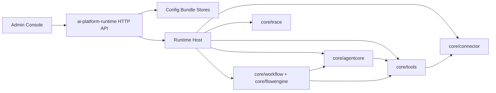

# Flow Anything

Flow Anything is a Go-first, config-as-code platform for building AI agents,
tools, connectors, and workflow/agent-flow runtimes.

The project is designed around one principle: **the console edits config, the
runtime loads config and executes it**. The same core runtime packages can be
used by a server-side AI platform today and by edge/device agent runtimes later.

> Status: early open-source alpha. APIs and config schemas may still evolve, but
> the core architecture is now centered on stable `core/*` packages.

## What It Provides

- Agent runtime with pluggable reasoning strategies such as ReAct and ReWOO.
- Agent Graph runtime for supervisor/sub-agent style multi-agent execution.
- Generic workflow engine with context protocol, control nodes, stateful
  execution, and event hooks.
- Tools abstraction for native, connector-backed, workflow-backed, MCP, script,
  and remote capabilities.
- Connector abstraction for external APIs, auth references, operation schemas,
  and protocol execution.
- Trace collection that turns runtime events into readable execution trees.
- React admin console for editing agents, skills, tools, connectors, workflows,
  bundles, and debug/test sessions.
- Local-first development with mock model defaults, file-backed bundles, trace
  history, and run history.

## Repository Layout

```text
core/                  Runtime primitives and reusable engine packages
internal/              Application services, adapters, HTTP API, bootstrap
cmd/ai-platform-runtime Unified backend runtime entrypoint
web/admin-console/     React admin console
configs/examples/      Safe starter config-as-code bundles
configs/local/         Local env examples; generated local files are ignored
scripts/local/         Local start/stop/restart and seed scripts
scripts/oss/           Open-source release checks
docs/                  Architecture, quickstart, design notes, research docs
```

## Quickstart

Prerequisites:

- Go 1.22+
- Node.js 20+ and npm
- ripgrep (`rg`) if you want to run the open-source preflight check

Install frontend dependencies:

```bash
make web-install
```

Start backend and frontend:

```bash
make start-services
```

Open the console:

```text
http://localhost:5173
```

The first startup creates local files from safe examples when they do not exist:

- `configs/local/services.env`
- `configs/local/workspace.draft.bundle.json`
- `configs/local/workspace.preview.bundle.json`
- `configs/local/workspace.release.bundle.json`

By default the runtime uses the deterministic mock model provider, so no API key
or external network access is required.

Stop services:

```bash
make stop-services
```

Run tests and frontend build:

```bash
make test
make web-build
```

Run the open-source safety check:

```bash
make oss-check
```

More detail: [docs/quickstart.md](docs/quickstart.md)

## Documentation Website

The project website lives in `website/` and is built with Docusaurus.

```bash
make website-install
make website-dev
```

Open:

```text
http://localhost:3000
```

Build the static site:

```bash
make website-build
```

## Configure A Real Model Provider

Keep secrets out of committed files. Put local overrides in:

```text
configs/local/services.local.env
```

Example:

```bash
FLOW_ANYTHING_MODEL_PROVIDER=deepseek
FLOW_ANYTHING_MODEL_BASE_URL=https://api.deepseek.com
DEEPSEEK_API_KEY=<your-deepseek-api-key>
```

The console and bundle config store secret references such as
`env:TAVILY_API_KEY`; actual values are read only by the runtime process.

## Architecture

Flow Anything has three layers:

- **Core**: `core/flowengine`, `core/agentcore`, `core/workflow`,
  `core/tools`, `core/connector`, `core/config`, `core/trace`.
- **Runtime application**: `internal/*` wires core packages to file stores,
  model adapters, connector adapters, debug sessions, run history, and HTTP.
- **Console/editor**: `web/admin-console` edits the standardized config
  protocol and sends preview/debug requests to the runtime.



More detail: [docs/architecture.md](docs/architecture.md)

## Open-Source Hygiene

Before making a branch public, run:

```bash
make oss-check
```

The check verifies:

- likely credentials are not present in tracked files;
- generated runtime files are ignored;
- required open-source docs are present.

Local-only files that must not be committed include `.runtime/`, `log/`,
`*.db`, `configs/local/services.env`, `configs/local/services.local.env`, and
generated local bundle snapshots.

## Contributing

Contributions are welcome. Please read [CONTRIBUTING.md](CONTRIBUTING.md) before
opening a pull request.

For security issues, do not open a public issue. See
[SECURITY.md](SECURITY.md).

## License

Apache License 2.0. See [LICENSE](LICENSE).
